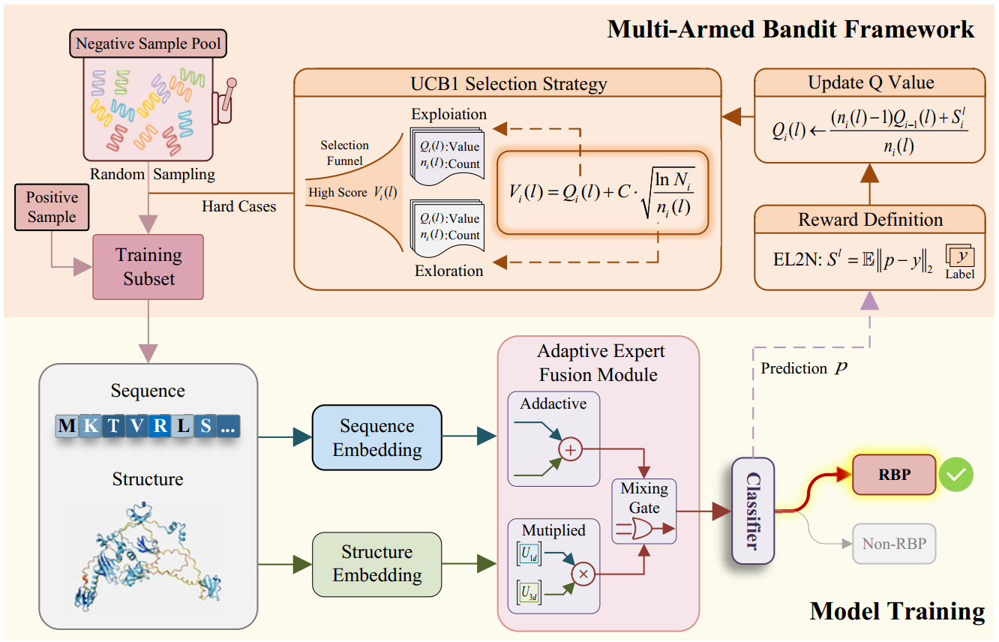

# SeekRBP
📄 Published in ****  
🔗 [Paper Link](https://ieeexplore.ieee.org/document/11129883)  

---

## 📖🧠 Introduction
<p align="center">
  
</p>
Bacteriophages are the most abundant and genetically diverse biological entities on Earth and play a central role in regulating bacterial populations and shaping microbial ecosystems. Many important applications of phages, including phage therapy, biocontrol, and microbiome engineering, rely on their specific interactions with bacterial hosts. These interactions are encoded in phage genomes, which contain a large number of proteins with potential biological and biotechnological value. However, most phage-encoded proteins remain poorly annotated, limiting the effective use of phages, especially under the growing threat of antimicrobial resistance.

Receptor-binding proteins (RBPs) are key mediators of phage–host interactions, as they initiate infection by recognizing and binding bacterial surface receptors. Accurate identification of RBPs is therefore essential for host prediction and downstream phage applications. This task is challenging due to extreme sequence diversity, rapid phage–host co-evolution, and severe class imbalance, where RBPs represent only a small fraction of phage proteins.

**SeekRBP** addresses these challenges by modeling RBP identification as a sequential decision-making problem. The framework combines sequence and structure representations with a reinforcement learning–inspired adaptive sampling strategy to improve recall and robustness in highly imbalanced settings.

### Key Innovations

- **Sequential decision-based formulation** that captures the dynamic informativeness of negative samples during training  
- **Bandit-based adaptive negative sampling** to efficiently focus on hard and informative negatives  
- **Joint sequence–structure modeling** to better represent functional determinants of receptor binding  
- **Adaptive fusion mechanism** for effective cross-modal feature integration  
---

## 📂 Clone Repository
```bash
git clone https://github.com/Saillxl/SeekRBP.git
cd SeekRBP/
```
---

## 📑 Dataset Preparation
The dataset should follow the format below. 


## ⚙️ Requirements
We recommend creating a clean environment:
```
conda create -n SeekRBP python=3.10
conda activate SeekRBP
pip install -r requirements.txt
```

## 🟠 Use sequential information only - ▶
### 🛠️ 1. Preparae features
Extract sequential features using [ESM2](https://github.com/facebookresearch/esm):  
First, specify the input file path (fasta_path) and the save path (save_dir). Then, run extract_esm2.py.
```
python extract_esm2.py
```
### 🚀 2. Training
Run train_sequence.py  
```
python train_sequence.py \
  --pos_txt ./dataset/pos_trainval/train_set_fold_1.txt \
  --neg_txt ./dataset/neg_trainval/train_set_fold_1.txt \
  --pos_dir ./sequence_features/pos_esm2_fea \
  --neg_dir ./sequence_features/neg_esm2_fea \
  --val_pos_txt ./dataset/pos_trainval/val_set_fold_1.txt \
  --val_neg_txt ./dataset/neg_trainval/val_set_fold_1.txt \
  --out ./results/train_sequence/ \
```
### 🧪 3. Testing
Run test_sequence.py
```
python test_sequence.py \
  --pos_txt ./dataset/pos_trainval_sets/test_set.txt \
  --neg_txt ./dataset/neg_trainval_sets/test_set.txt \
  --pos_dir ./sequence_features/pos_esm2_fea \
  --neg_dir ./sequence_features/neg_esm2_fea \
  --load_model ./results/train_sequence/transformer_binary.pth \
  --out ./results/test_sequence
```
## 🟢 Use structural information only- ▶
### 🛠️ 1. Preparae features
Extract structural features using [Saprot](https://github.com/westlake-repl/SaProt):  
① Obtain protein structures (.pdb) using [AlphaFold](https://github.com/google-deepmind/alphafold) and [ColabFold](https://github.com/sokrypton/ColabFold). If you already have structures, you can skip this step.    
② Download the [Saprot](https://github.com/westlake-repl/SaProt) project, and then place the "extract_saprot.py" in the Saprot project directory. Finally, run batch_saprot_from_structure.py.
```
python extract_saprot.py \
  --input_dir fasta_path \
  --output_dir ./structure_features
```
### 🚀 2. Training
Run train_structure.py  

### 🧪 3. Testing
Run test_structure.py
```
python test_structure.py \
  --pos_txt ./dataset/pos_trainval_sets/test_set.txt \
  --neg_txt ./dataset/neg_trainval_sets/test_set.txt \
  --pos_dir ./sequence_features/pos_esm2_fea \
  --neg_dir ./sequence_features/neg_esm2_fea \
  --load_model ./results/train_sequence/transformer_binary.pth \
  --out ./results/test_sequence
```

## 🔵 Use sequential information and structural information - ▶
### 🛠️ 1. Preparae features
➡️ Extract sequential features using [ESM2](https://github.com/facebookresearch/esm):  
First, specify the input file path (fasta_path) and the save path (save_dir). Then, run extract_esm2.py.
```
python extract_esm2.py
```
➡️ Extract structural features using [Saprot](https://github.com/westlake-repl/SaProt):  
① Obtain protein structures (.pdb) using [AlphaFold](https://github.com/google-deepmind/alphafold) and [ColabFold](https://github.com/sokrypton/ColabFold). If you already have structures, you can skip this step.    
② Download the [Saprot](https://github.com/westlake-repl/SaProt) project, and then place the "extract_saprot.py" in the Saprot project directory. Finally, run batch_saprot_from_structure.py.
```
python extract_saprot.py \
  --input_dir fasta_path \
  --output_dir ./structure_features
```

### 🚀 2. Training
Run train_dual.py  
```
python train_sequence.py \
  --pos_txt ./dataset/pos_trainval/train_set_fold_1.txt \
  --neg_txt ./dataset/neg_trainval/train_set_fold_1.txt \
  --pos_dir ./sequence_features/pos_esm2_fea \
  --neg_dir ./sequence_features/neg_esm2_fea \
  --val_pos_txt ./dataset/pos_trainval/val_set_fold_1.txt \
  --val_neg_txt ./dataset/neg_trainval/val_set_fold_1.txt \
  --out ./results/train_dual/ \
```
### 🧪 3. Testing
Run test_dual.py
```
python test_sequence.py \
  --pos_txt ./dataset/pos_trainval_sets/test_set.txt \
  --neg_txt ./dataset/neg_trainval_sets/test_set.txt \
  --pos_dir ./sequence_features/pos_esm2_fea \
  --neg_dir ./sequence_features/neg_esm2_fea \
  --load_model ./results/train_sequence/transformer_binary.pth \
  --out ./results/test_sequence

```
## 📌 Citation
If you find this repository useful, please cite our paper(bibtex):
```

```

## 🙏 Acknowledgement
[ESM2](https://github.com/facebookresearch/esm)
[AlphaFold](https://github.com/google-deepmind/alphafold)
[ColabFold](https://github.com/sokrypton/ColabFold)
[Saprot](https://github.com/westlake-repl/SaProt)
##
